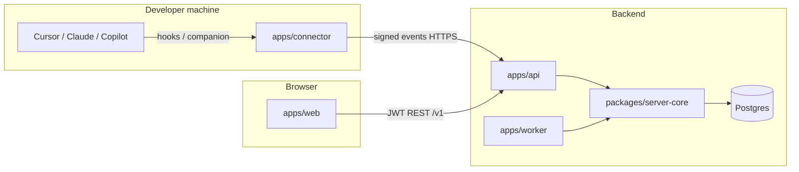

# Techlio project structure

This document describes how the **Techlio AI Activity Monitoring** monorepo is organised: what each top-level folder does, how apps and packages relate, and where to look when changing behaviour.

**Product shape:** managers drill from organisation → employees → one person → AI tool → sessions → session detail. Telemetry comes from **connected AI coding agents** on developer machines, not from keystrokes, prompts, or source code.

---

## Monorepo at a glance

| Tooling | Role |
|--------|------|
| **pnpm workspaces** | Links `apps/*` and `packages/*` |
| **Turborepo** | `pnpm build`, `pnpm test`, `pnpm lint` across packages |
| **TypeScript** | Shared language; packages compile to `dist/` where needed |
| **Postgres** | System of record (Neon in production) |
| **Redis** | Optional queue for worker (hourly finalisation, pulls) |

Typical local stack:

```text
Developer machine                    Hosted (Vercel / Render)
─────────────────                    ─────────────────────────
apps/connector  ──events──►  apps/api  ◄──HTTP──  apps/web
     :9477                      :3001              :3000
                                    │
                                    ▼
                              Postgres (+ Redis + apps/worker)
```

---

## Repository root

| Path | Purpose |
|------|---------|
| [`apps/`](#apps) | Runnable applications (API, web, connector, worker, extension) |
| [`packages/`](#packages) | Shared libraries consumed by apps |
| [`infra/sql/`](#database-migrations) | Versioned SQL migrations (source of truth for schema) |
| [`scripts/`](#scripts) | Migrations, deploy, env sync, connector packaging |
| [`docs/`](#documentation) | Deploy guides, ADRs, ops runbooks, this file |
| [`memory-bank/`](#memory-bank) | Product/tech context for humans and agents (PRD-aligned) |
| [`tests/e2e/`](#end-to-end-tests) | Playwright-style flows against a running stack |
| [`docker-compose.yml`](../../docker-compose.yml) | Local Postgres + Redis |
| [`render.yaml`](../../render.yaml) | Render blueprint for API/worker (alternative to Vercel API) |
| [`package.json`](../../package.json) | Root scripts: `dev`, `db:migrate`, `db:seed`, `admin:create`, etc. |

---

## Apps

### `apps/web` — Dashboard (Next.js 15)

**Package:** `@techlio/web` · **Port:** 3000 (dev)

Next.js App Router UI. **All metrics are loaded from the API**; the browser does not re-aggregate session math.

| Area | Path | Notes |
|------|------|--------|
| Routes | `src/app/` | File-based routes (`page.tsx`, `layout.tsx`) |
| Shell & nav | `src/components/AppShell.tsx` | Role-based sidebar, header, timezone |
| Charts & domain UI | `src/components/charts/`, `src/components/domain/` | Recharts, tables, connector setup |
| Client libs | `src/lib/` | `api.ts`, `auth-context.tsx`, `use-api.ts`, `format.ts`, permissions |
| Platform tenant view | `src/app/platform/[orgId]/` | Super admin inspects a customer org (re-exports tenant pages) |
| Static downloads | `public/downloads/` | Connector installers served to employees |

Important routes: `/`, `/employees`, `/employees/[id]`, `/sessions/[id]`, `/connectors`, `/users`, `/settings`, `/platform`, `/login`.

Env: `NEXT_PUBLIC_API_URL` must point at the hosted API in production.

---

### `apps/api` — HTTP API (NestJS + Fastify)

**Package:** `@techlio/api` · **Port:** 3001 (dev)

Thin HTTP layer over `@techlio/server-core`. Auth, RBAC, and org scoping live here; business logic and SQL sit in server-core.

| Area | Path | Notes |
|------|------|--------|
| Entry | `src/main.ts`, `src/app.module.ts` | Nest bootstrap |
| Auth | `src/auth/` | JWT, guards, org context header for platform super admin |
| Controllers | `*controller.ts` | REST under `/v1/...` |
| Ingest | `src/events.controller.ts`, `src/services/ingest.ts` | Signed event batches from connectors |
| Scripts | `src/scripts/seed.ts`, `create-admin.ts` | Local seed, production admin CLI |

Main controllers:

- `analytics.controller.ts` — org/employee aggregates, leaderboard, calendars
- `dashboard.controller.ts` — live connectors, alerts, polling endpoint
- `org.controller.ts` — users, audit, policy
- `profile.controller.ts` — profile, password, org branding
- `platform.controller.ts` — multi-tenant org CRUD (super admin)
- `connectors.controller.ts`, `sessions.controller.ts`, `exports.controller.ts`

Env: `DATABASE_URL`, `JWT_SECRET`, `ORG_TIMEZONE` (default reporting TZ, e.g. `Asia/Karachi`), `SKIP_REDIS` when no worker.

---

### `apps/connector` — Local agent (per developer machine)

**Package:** `@techlio/connector` · **Port:** 9477–9486 (per OS user)

Background service on the developer’s Mac/PC. Installs hooks (Cursor, Claude Code), queues signed events, talks to `127.0.0.1` from the browser for pairing/health.

| Area | Path | Notes |
|------|------|--------|
| Core | `src/` | Ingest pipeline, hooks installer, HTTP server |
| Hooks | `hook/` | Scripts invoked by IDE agents |
| Packaging | `macos/`, `scripts/` | `.pkg` / Windows installer build |
| Bundled for web | via `scripts/pack-connector.mjs` → `apps/web/public/downloads/` |

Employees do **not** clone this repo; they install from the dashboard.

---

### `apps/worker` — Background jobs

**Package:** `@techlio/worker`

BullMQ worker: hourly snapshot finalisation, retention, Tier B provider pulls (Cursor admin API, GitHub Copilot reports). Requires Redis unless API runs with `SKIP_REDIS` (inline recalc only).

---

### `apps/extension` — IDE extension (optional)

**Package:** `@techlio/extension`

VS Code companion signals (metadata-only); complements Tier A hooks. Built to `dist/` for side-load or store packaging.

---

## Packages

Shared libraries imported as `@techlio/<name>`.

| Package | Purpose |
|---------|---------|
| **`server-core`** | Database (Drizzle), schema mirrors, **all analytics SQL**, sessions metrics, users/RBAC, platform multi-tenant, ingest helpers, seed |
| **`event-schema`** | Zod schemas for allowlisted event metadata (privacy boundary) |
| **`aggregation`** | Interval merge/duration helpers used when computing session metrics |
| **`provider-adapters`** | Normalisation for Claude hooks, Copilot pull, etc. |
| **`puller`** | Tier B daily pull orchestration shared with worker |

**Rule of thumb:** if it touches Postgres queries or session classification, it probably belongs in `packages/server-core/src/`. The API should delegate, not duplicate.

Notable `server-core` modules:

- `analytics.ts` — org/employee aggregates, trends, patterns
- `sessions.ts` — `computeSessionMetrics`, session listing
- `ingest.ts` / `sessionize.ts` — event → session assignment
- `users.ts`, `roles.ts`, `org-context.ts` — portal users and tenant scope
- `platform.ts` — customer organisations (super admin)
- `workday.ts`, `ai-progress.ts`, `activity-feed.ts` — employee drill-down views
- `timezone.ts` — org default TZ and display-timezone resolution

---

## Database migrations

**Location:** `infra/sql/001_….sql` … `014_….sql` (ordered by filename)

Applied by:

```bash
pnpm db:migrate          # local (.env.local)
pnpm db:migrate:prod     # production (Vercel-pulled env)
```

Applied once per file; recorded in `schema_migrations`. **Tables are not created on API boot** — migrations must run before deploy.

Drizzle schema in `packages/server-core/src/schema.ts` should stay aligned with SQL migrations.

---

## Scripts (`scripts/`)

| Script | Role |
|--------|------|
| `migrate.mjs` | Apply `infra/sql/*.sql` |
| `migrate-prod.sh` | Production migrate wrapper |
| `admin-create-prod.sh` | Create portal admin against prod DB |
| `restore-env-from-vercel.sh` | Pull Vercel env into `.env.production.local` |
| `sync-vercel-env.sh` | Push standard vars (JWT, SKIP_REDIS, ORG_TIMEZONE, web API URL) |
| `pack-connector.mjs` | Connector release artifacts |
| `deploy-all.sh`, `deploy-vercel.sh` | Deployment helpers |
| `check-env-files.mjs` | Validates local env files (no `[SENSITIVE]` placeholders) |

---

## Documentation

| Path | Contents |
|------|----------|
| [`docs/DEPLOY.md`](DEPLOY.md) | Production env, migrate, admin, Vercel/Render |
| [`docs/TECHNICAL_OVERVIEW.md`](TECHNICAL_OVERVIEW.md) | Deeper architecture |
| [`docs/ops/runbook.md`](ops/runbook.md) | Operations |
| [`docs/UI_PRD_COVERAGE.md`](UI_PRD_COVERAGE.md) | UI vs PRD checklist |
| [`memory-bank/requirements.md`](../memory-bank/requirements.md) | Full PRD text |

---

## Memory bank

[`memory-bank/`](../memory-bank/) holds concise context for development:

- `projectbrief.md`, `productContext.md`, `requirements.md`
- `techContext.md`, `systemPatterns.md`
- `activeContext.md`, `progress.md`, `pending.md`

Read these before large features; they encode privacy rules (no prompts, no ranking as performance, missing telemetry ≠ zero).

---

## End-to-end tests

[`tests/e2e/`](../tests/e2e/) — scenario tests run after `turbo run test` via `pnpm --filter @techlio/e2e test`. Expect API + web + DB available.

---

## Data and control flow (ingest → dashboard)



1. Connector emits **allowlisted** metadata events with stable `event_id`.
2. API validates signature + schema, ingests idempotently, updates `agent_sessions` metrics via `computeSessionMetrics`.
3. Worker finalises hourly snapshots (when Redis is enabled).
4. Web calls `/v1/analytics/*`, `/v1/dashboard/live`, etc.; UI shows explicit empty states for gaps/offline connectors.

---

## Roles and tenancy

| Role | Typical access |
|------|----------------|
| **manager** | Org analytics, employees, no user admin |
| **administrator** | Users, connectors, full org analytics |
| **developer** | Own employee analytics only; local connector required |
| **auditor** | Audit + connectors policy; no individual timelines |
| **super_admin** | Platform org list; inspect any customer tenant via `x-techlio-org-id` (read-only writes blocked) |

Organisation id is on every query; developers are scoped to their `developerId`.

---

## Where to start for common tasks

| Task | Start here |
|------|------------|
| New dashboard screen | `apps/web/src/app/...`, reuse `AppShell`, `useApi`, `ChartFrame` |
| New aggregate or KPI | `packages/server-core/src/analytics.ts`, wire in `analytics.controller.ts` |
| Change event fields | `packages/event-schema`, connector normalisation, migration if storage changes |
| New migration | `infra/sql/0XX_name.sql`, then `pnpm db:migrate` |
| Connector behaviour | `apps/connector/src`, `packages/provider-adapters` |
| Production deploy | `docs/DEPLOY.md`, `scripts/migrate-prod.sh` before API traffic |

---

## Related reading

- [README.md](../README.md) — quick start and demo logins (local dev only)
- [systemPatterns.md](../memory-bank/systemPatterns.md) — non-negotiable design rules (durations, coverage, RBAC)
